# Bigger / Advanced layouts
There comes a time where a basic "row-layout" as described in tutorial "01 Getting-started" just isn't enough.

There are a couple of common cases, when this might happen.

E.g. when you have too many elements.
The GUI gets too crowded and is neither good looking, nor user-friendly.

Another case, is that you want to place a couple of smaller elements in the same row as a big element (like `sg.Listbox`):\
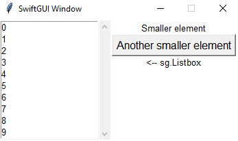\
Since the `sg.Listbox` is only one element in one row, this is not possible without utilizing the functionalities described in this tutorial.
You can't add "multiple rows to a single row", without using frames.

# Frames
The above example is done using the element `sg.Frame`.

A frame allows you to pack a whole layout into a single element.
The above example consists of two actual layouts, the "outer"/main one (green) and a smaller "inner" one (red):\
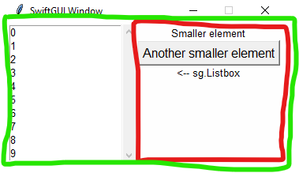
```py
### Layout ###
inner_layout = [
    [sg.T("Smaller element")],
    [sg.Button("Another smaller element")],
    [sg.T("<-- sg.Listbox")]
]

layout:list[list[sg.BaseElement]] = [
    [
        sg.Listbox(
            range(10)
        ),
        sg.Frame(
            inner_layout,
            expand_y=True
        )
    ]
]

w = sg.Window(layout)
```
As you can see, we just created a second layout in the same way the first one was created, then packed it into `sg.Frame`.

`expand_y=True` is necessary, so the frame spans the whole height of the row.
If you set it to `False` (default), the frame will only be as big as necessary, which aligns the elements centered:\
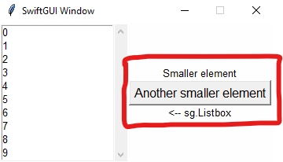\
This might be intended for some layouts, but that's up to you.

## LabelFrame
There are different kinds of frames (2 at the moment, version 0.5.3).

I find `sg.LabelFrame` especially good looking in bigger layouts, because it divides seperate parts of the layout visibly:\
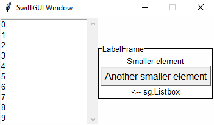
```py
layout:list[list[sg.BaseElement]] = [
    [
        sg.Listbox(
            range(10)
        ),
        sg.LabelFrame(
            inner_layout,
            text = "LabelFrame",
        )
    ]
]
```
`sg.LabelFrame` has all the options a normal `sg.Frame` has and some additionl ones that won't be covered by this tutorial.

To not draw sketchy red borders all the time, I'm going to use `sg.LabelFrame` with `no_label=True` going further:\
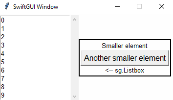

## Horizontal alignment
Elements are aligned "center" by default.
To allign them differently, just pass the option `alignment` to the surrounding frame:\
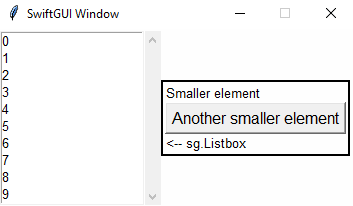
```py
    sg.LabelFrame(
        inner_layout,
        no_label=True,
        alignment= "left",
    )
```
This only applies to that frame though, containing frames won't be affected.

Since the main window also contains an `sg.Frame`, you can set the alignment for it too:
```py
### Layout ###
inner_layout = [
    [sg.T("Smaller element")],
    [sg.Button("Another smaller element")],
    [sg.T("<-- sg.Listbox")]
]

layout:list[list[sg.BaseElement]] = [
    [
        sg.Listbox(
            range(10)
        ),
        sg.LabelFrame(
            inner_layout,
            no_label=True,
        )
    ],[
        sg.T("Below Frames")
    ]
]

w = sg.Window(layout, alignment="left")
```
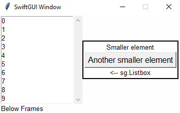\
Again, this won't affect containing frames, so the `sg.LabelFrame` is aligned differently.

To set the alignment for all frames, including the main window, use the global-options:
```py
### Global options ###
sg.GlobalOptions.Frame.alignment = "left"

### Layout ###
inner_layout = [
    [sg.T("Smaller element")],
    [sg.Button("Another smaller element")],
    [sg.T("<-- sg.Listbox")]
]

layout:list[list[sg.BaseElement]] = [
    [
        sg.Listbox(
            range(10)
        ),
        sg.LabelFrame(
            inner_layout,
            no_label=True,
        )
    ],[
        sg.T("Below Frames")
    ]
]

w = sg.Window(layout)
```
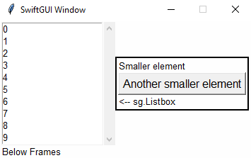

## Background color propagation
This feature took me 2 very annoying days to properly implement, so please appreciate it.

Every frame has its own background-color, they are not actually transparent, unfortunately.
This is due to `tkinter`, the package behind SwiftGUI.

That's why SwiftGUI has a feature called "background color propagation".
It basically applies changes to the background-color of a frame to all containing elements with certain properties.

So when changing the background-color of a frame, that frame will check elements inside its layout if they have these certain properties.
Then, the frame changes the background-color of these elements too.

Example:
```py
### Layout ###
inner_layout = [
    [sg.T("Smaller element")],
    [sg.Button("Another smaller element")],
    [sg.T("<-- sg.Listbox")]
]

layout:list[list[sg.BaseElement]] = [
    [
        sg.Listbox(
            range(10)
        ),
        sg.LabelFrame(
            inner_layout,
            no_label=True,
        )
    ],[
        sg.T("Below Frames")
    ]
]

w = sg.Window(layout, alignment="left", background_color="red")
```
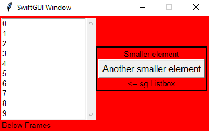

It might not sound that cool, but remember that elements with "open" texts, like `sg.Text` and `sg.Checkbox` also have their own background-color.

Without background-color-propagation, the GUI'd look like that:\
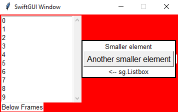


If you set a background-color for specific elements, they automatically won't apply the surrounding frame's background-color:
```py
layout:list[list[sg.BaseElement]] = [
    [
        sg.Listbox(
            range(10)
        ),
        sg.LabelFrame(
            inner_layout,
            no_label=True,
            background_color="green"
        )
    ],[
        sg.T("Below Frames", background_color="lightblue")
    ]
]

w = sg.Window(layout, alignment="left", background_color="red")
```
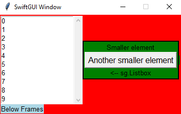

However, **when using `.update(background_color = ...)`, the color-propagation won't be disabled**.
The background-color will still change, when a containing frame updates:
```py
layout:list[list[sg.BaseElement]] = [
    [
        sg.Listbox(
            range(10)
        ),
        myFrame := sg.LabelFrame(
            inner_layout,
            no_label=True,
        )
    ],[
        sg.T("Below Frames")
    ]
]

w = sg.Window(layout, alignment="left")
myFrame.update(background_color = "lightblue")  # Frame is blue now
w.update(background_color = "red")  # Frame is red again
```
You can disable that behaviour manually by setting `apply_parent_background_color = False`:
```py
layout:list[list[sg.BaseElement]] = [
    [
        sg.Listbox(
            range(10)
        ),
        myFrame := sg.LabelFrame(
            inner_layout,
            no_label=True,
            apply_parent_background_color= False,
        )
    ],[
        sg.T("Below Frames")
    ]
]

w = sg.Window(layout, alignment="left")
myFrame.update(background_color = "lightblue")  # Frame is blue now
w.update(background_color = "red")  # Frame doesn't change
```
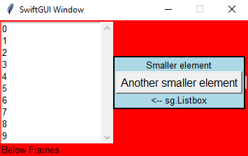\
(That blue line next to the frame is a known bug I'm going to fix sooner or later, version 0.5.3 atm. It only occurs for LabelFrames without label and color-propagation.)

For frames, you could also disable changing the color of containing elements by setting `pass_down_background_color= False`:
```py
    myFrame := sg.LabelFrame(
        inner_layout,
        no_label=True,
        pass_down_background_color= False,
    )
```
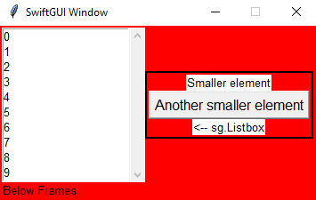\
You'll probably never need to do that, but hey, your decision.


# Notebook (Tabview)
The `sg.Notebook`, aka `sg.Tabview` helps to deal with too many elements by not showing all at once:\
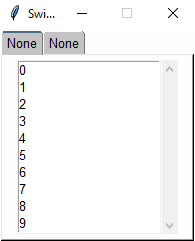\
Other tab:\
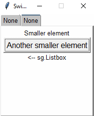
```py
### Layout ###
left_tab = sg.Frame([
    [
        sg.Listbox(
            range(10)
        ),
    ]
])

right_tab = sg.Frame([
    [sg.T("Smaller element")],
    [sg.Button("Another smaller element")],
    [sg.T("<-- sg.Listbox")]
])

layout:list[list[sg.BaseElement]] = [
    [
        sg.Notebook(
            left_tab,
            right_tab,
        )
    ]
]

w = sg.Window(layout)
```
As you can see, the `sg.Notebook` takes frames (Any type of frame, `sg.LabelFrame` works aswell) and organizes them in tabs.

To set proper names for the tabs, the containing frames need keys.
If a key is available, it will be used as the name:
```py
### Layout ###
left_tab = sg.Frame([
    [
        sg.Listbox(
            range(10)
        ),
    ]
], key= "left")

right_tab = sg.Frame([
    [sg.T("Smaller element")],
    [sg.Button("Another smaller element")],
    [sg.T("<-- sg.Listbox")]
], key= "right")

layout:list[list[sg.BaseElement]] = [
    [
        sg.Notebook(
            left_tab,
            right_tab,
        )
    ]
]
```
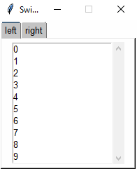

Since this might be a little "unconfortable", you can overwrite the name.
To do that, pass a dictionary containing the frame-keys as key and the corresponding value as the new name:
```py
    sg.Notebook(
        left_tab,
        right_tab,
        tab_texts= {
            "left": "Fancy left tab-name"
        }
    )
```
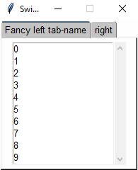

There will be a better way to set names, I promise (version 0.5.3).\
I really don't like using global keys for something like that, it feels too much like PySimpleGUI...

`sg.Notebook` will probably change a lot until version 1.0.0, but it's very useful in its current state already.

`sg.Notebook` has an event-system.
You can throw an event when the opened tab changed, or when a certain tab was opened.
Since this tutorial is ment to be only about layouts, it will be explained in the element-tutorial for `sg.Notebook`.

# Separators
`sg.HorizontalSeparator` and `sg.VerticalSeparator` are basically just horizontal/vertical lines that are useful for dividing the layout visibly:\
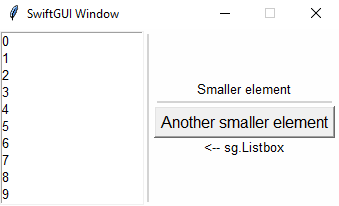
```py
### Layout ###
inner_layout = [
    [sg.T("Smaller element")],
    [sg.HorizontalSeparator()], # <-- here
    [sg.Button("Another smaller element")],
    [sg.T("<-- sg.Listbox")]
]

layout:list[list[sg.BaseElement]] = [
    [
        sg.Listbox(
            range(10),
            scrollbar= False,
        ),
        sg.VerticalSeparator(), # <-- here
        sg.Frame(
            inner_layout,
        )
    ]
]

w = sg.Window(layout)
```
Their names are pretty long, so you might want to use the aliases `sg.HSep` and `sg.VSep`.

You can change the `color` and thickness (`weight`) of separators:\
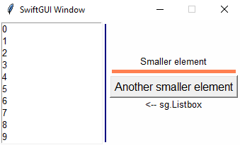
```py
### Layout ###
inner_layout = [
    [sg.T("Smaller element")],
    [sg.HSep(weight=5, color= sg.Color.coral)], # <-- here
    [sg.Button("Another smaller element")],
    [sg.T("<-- sg.Listbox")]
]

layout:list[list[sg.BaseElement]] = [
    [
        sg.Listbox(
            range(10),
            scrollbar= False,
        ),
        sg.VSep(color= sg.Color.navy), # <-- here
        sg.Frame(
            inner_layout,
        )
    ]
]
```
Default `weight` is 2.

You can actually change these options using `.update` too.

# Spacer
A `sg.Spacer` is a pseudo-invisible element with a certain size.

You can use it to add some space inbetween elements/rows.

At this time, it is the only element without its own global-options-class.

Example:
```py
### Layout ###
layout:list[list[sg.BaseElement]] = [
    [
        sg.T("Normal text"),
        sg.Spacer(width=50),
        sg.T("Text far to the right"),
    ],[
        sg.Spacer(height=50)
    ],[
        sg.T("Text far below")
    ]
]

w = sg.Window(layout)
```
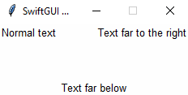

## Aligning frame-widgets to the bottom of a frame
In the beginning of this tutorial you have learned that you need to set `expand_y` so the elements align to the actual top of the row:
```py
### Layout ###
inner_layout = [
    [sg.T("Smaller element")],
    [sg.Button("Another smaller element")],
    [sg.T("<-- sg.Listbox")]
]

layout:list[list[sg.BaseElement]] = [
    [
        sg.Listbox(
            range(10)
        ),
        sg.Frame(
            inner_layout,
            expand_y=True
        )
    ]
]

w = sg.Window(layout)
```
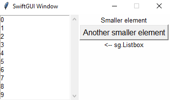

There is no "native" way of aligning elements to the bottom of a frame.

However, if there were an invisible element that took as much vertical (y) space as possible, it would push all other elements down.
You probably see what I am getting at:
```py
inner_layout = [
    [sg.Spacer(expand_y= True)],
    [sg.T("Smaller element")],
    [sg.Button("Another smaller element")],
    [sg.T("<-- sg.Listbox")]
]
```
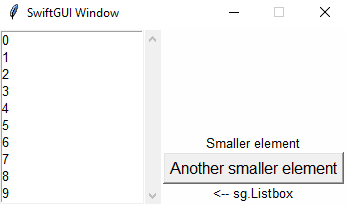

This way, you can also align some elements to the top and some to the bottom:
```py
inner_layout = [
    [sg.T("Smaller element")],
    [sg.Button("Another smaller element")],
    [sg.Spacer(expand_y= True)],
    [sg.T("<-- sg.Listbox")]
]
```
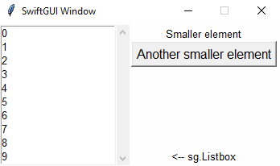


